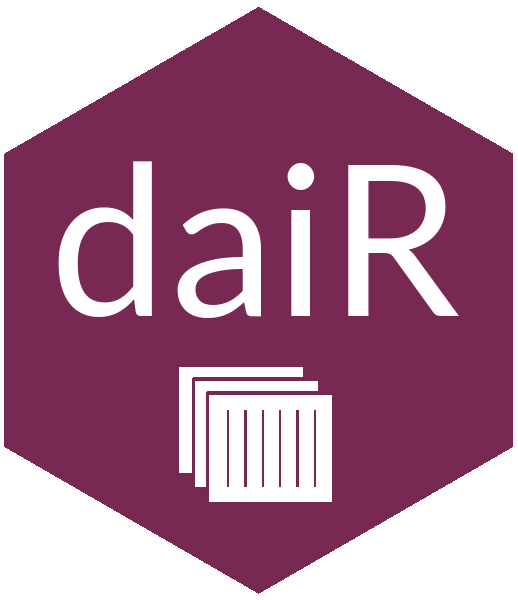

# daiR: OCR with Google Document AI in R



**daiR** is an R package for [Google Document AI](https://cloud.google.com/document-ai), a powerful server-based OCR processor with support for over 60 languages. The package provides an interface for the Document AI API and comes with additional tools for output file parsing and text reconstruction. See the `daiR` [website](https://dair.info/) for more details.

## Use

Quick OCR short documents:

```R
## NOT RUN
library(daiR)
response <- dai_sync("file.pdf")
text <- text_from_dai_response(response)
cat(text)
```

Batch process asynchronously via Google Storage:

```R
## NOT RUN
library(googleCloudStorageR)
library(purrr)
my_files <- c("file1.pdf", "file2.pdf", "file3.pdf")
map(my_files, gcs_upload)
dai_async(my_files)
contents <- gcs_list_objects()
output_files <- grep("json$", contents$name, value = TRUE)
map(output_files, ~ gcs_get_object(.x, saveToDisk = file.path(tempdir(), .x)))
sample_text <- text_from_dai_file(file.path(tempdir(), output_files[1]))
cat(sample_text)
```

Turn images of tables into R dataframes:

```R
## NOT RUN:
response <- dai_sync_tab("tables.pdf")
dfs <- tables_from_dai_response(response)
```

## Requirements

Google Document AI is a [paid service](https://cloud.google.com/document-ai/pricing) that requires a [Google Cloud](https://console.cloud.google.com/) account and a [Google Storage](https://cloud.google.com/storage) bucket. I recommend using Mark Edmondson's `googleCloudStorageR` [package](https://github.com/cloudyr/googleCloudStorageR) in combination with `daiR`.

## Installation

Download from CRAN:

```R
utils::install.packages("daiR")
```

Or install the latest development version from Github:

```R
devtools::install_github("hegghammer/daiR")
```

## Acknowledgments

Thanks to Mark Edmondson, Hallvar Gisnås, Will Hanley, Neil Ketchley, Trond Arne Sørby, Chris Barrie, and Geraint Palmer for contributions to the project.

## Code of conduct

Please note that the daiR project is released with a [Contributor Code of Conduct](https://www.contributor-covenant.org/version/2/0/code_of_conduct/). By contributing to this project, you agree to abide by its terms.

<!-- badges: start -->
[](https://CRAN.R-project.org/package=daiR)
[](https://github.com/Hegghammer/daiR/actions/workflows/package-check.yml)
[](https://codecov.io/gh/Hegghammer/daiR?branch=master)
<!-- badges: end -->
