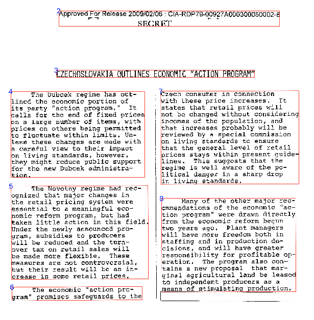

# daiR: OCR with Google Document AI in R

<!-- badges: start -->
[](https://CRAN.R-project.org/package=daiR)
<!-- badges: end -->

**daiR** is an R package for [Google Document AI](https://cloud.google.com/document-ai), a powerful server-based OCR processor with support for some 60 languages. The package provides a wrapper for the Document AI API and comes with additional tools for output file parsing and text reconstruction.



## Use

Quick OCR a document of up to 5 pages:

```R
## NOT RUN
library(daiR)
response <- dai_sync("file.pdf")
text <- text_from_dai_response(response)
cat(text)
```

Batch process any number of documents via Google Storage:

```R
## NOT RUN
library(googleCloudStorageR)
library(purrr)
my_files <- c("file1.pdf", "file500.tiff", "file1000.gif")
map(my_files, gcs_upload)
dai_async(my_files)
contents <- gcs_list_objects()
output_files <- grep("json$", contents$name, value = TRUE)
map(output_files, ~ gcs_get_object(.x, saveToDisk = .x))
sample_text <- text_from_dai_file(output_files[1])
cat(sample_text)
```

Turn images of tables into R dataframes:

```R
## NOT RUN:
response <- dai_sync_tab("tables.pdf")
dfs <- tables_from_dai_response(response) 
```

## Requirements

Google Document AI is a [paid service](https://cloud.google.com/document-ai/pricing) that requires a [Google Cloud](https://console.cloud.google.com/) account and a [Google Storage](https://cloud.google.com/storage) bucket. I recommend using Mark Edmondson's `googleCloudStorageR` [package](https://github.com/cloudyr/googleCloudStorageR) in combination with `daiR`. See [vignettes](http://dair.info/) for more on authentication and setup.

## Installation

`daiR` is not yet on CRAN, but you can install the latest development version from Github:

```R
devtools::install_github("hegghammer/daiR")
```

