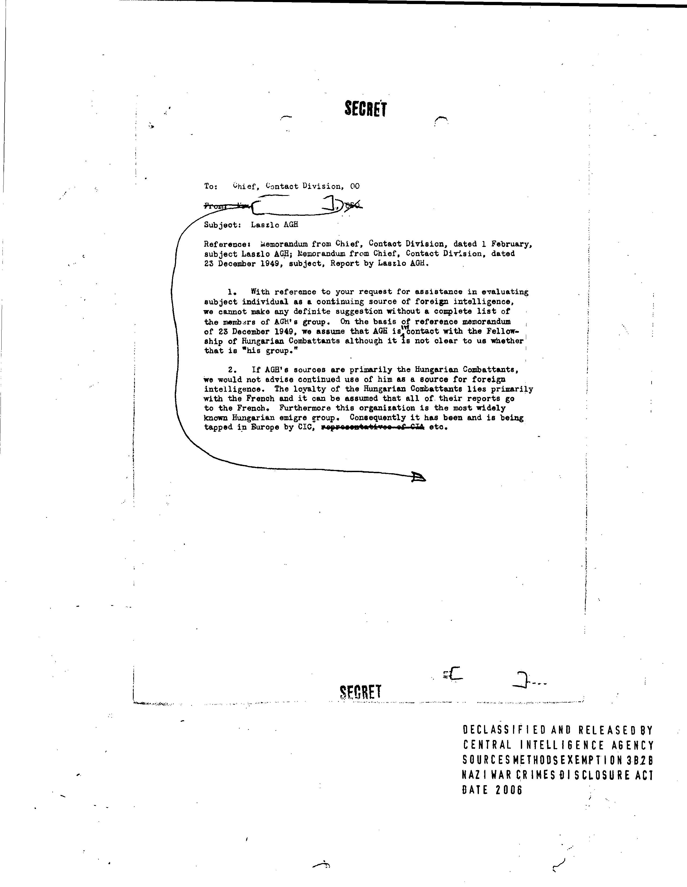

```{r, include = FALSE}
knitr::opts_chunk$set(
  collapse = TRUE,
  comment = "#>"
)
library(knitr)
```

Somewhat surprisingly, the Google Document AI tool suite does not include a straightforward way to embed OCR output in PDFs. This functionality exists in many other OCR products -- in Tesseract, for example, it's as simple as running(`tesseract input.jpg output pdf`) -- so I suspect Google just hasn't prioritized it. Interestingly, the Python client library "Document AI Toolbox" includes a [hOCR conversion script](https://cloud.google.com/document-ai/docs/toolbox#hocr-conversion)) but stops short of providing a method for creating searchable PDFs.

This said, writing code to reliably create searchable PDFs from custom OCR output is not straightforward, especially outside of Python. The main challenge is embedding text in PDFs in the right places, handling font sizes and encoding issues along the way. As far as I am aware, the only open-source tool that can do it well is the [Reportlab PDF Toolkit](https://docs.reportlab.com/) (a Python library). But the Reportlab toolkit itself does not include a direct solution for converting OCR output formats such as HOCR and ALTO to searchable PDFs, so it is left to small community efforts such as [hocr-tools](https://github.com/ocropus/hocr-tools) to implement it (by adapting Reportlab's code). Meanwhile, in R, there are no packages that can embed text in PDFs, let alone create searchable PDFs from custom OCR output.

This is why `daiR` does not provide a native R solution for embedding OCR-extracted text in PDFs. However, as of version 0.9.9, `daiR` includes the function `make_hocr`, which creates HOCR files from Document AI output, and this takes us some of the distance. This article will describe a simple pipeline which combines `dair::make_hocr` and the command-line tool [hocr-pdf](https://github.com/ocropus/hocr-tools#hocr-pdf) from the aforementioned hocr-tools project.

Before we begin, you may want to install `hocr-tools` on your computer. Instructions are [here](https://github.com/ocropus/hocr-tools). Note that the package version on PyPI currently lags behind the Github codebase, and I had to clone the repository and build from source to get the `hocr-pdf` function to work. This situation will hopefully change in due course.

Note that hocr-pdf only handles individual `.jpg` images, and it works best if the hocr file is generated from an OCR process involving the same `.jpg` file. This means you cannot process a multi-page pdf in Document AI and take the output to hocr-pdf; you need to convert the pdf to a set of `.jpg` files first and then feed them individually to Document AI, so that you get hocr files that match the `.jpg` files. Other than this quirk, the procedure works well.  

In this illustration, we will use a single, "ready made" `.jpg`. Conversion from PDF to `.jpg` can be done quite easily with packages like `pdftools` or `magick`.

```{r echo = FALSE, out.width = "50%"}

```

Let us start by downloading the image into a temporary subdirectory of our working directory.

```{r, eval = FALSE}
dir.create("temp")
download.file("https://dair.info/articles/sample.jpg", "temp/sample.jpg")
```

Then we process the image synchronously with Document AI.

```{r, eval = FALSE}
library(daiR)
resp <- dai_sync("temp/sample.jpg")
```

Then we generate the HOCR file:

```{r eval = FALSE}
make_hocr(type = "sync", output = resp, dir = "temp", outfile_name = "sample.hocr")
```

Note that the two files `sample.jpg` and `sample.hocr` carry the same name (`sample`) and reside in the same directory (`temp`). Both conditions are necessary for `hocr-pdf` to work.

If `hocr-tools` is installed, we can now run the `hocr-pdf` utility, either in the terminal or from within R using the `system()` command.  

In the terminal: 

```{bash}
hocr-pdf temp > temp/sample.pdf
```

In R:

```{r, eval = FALSE}
system("hocr-pdf temp > temp/sample.pdf")
```

And you should now have a searchable PDF in the `temp` directory.

```{r echo = FALSE, out.width = "50%"}
include_graphics("sample_searchable.png")
```

To remove the directory with the example files:
```{r eval = FALSE}
unlink("temp", recursive = TRUE)
```