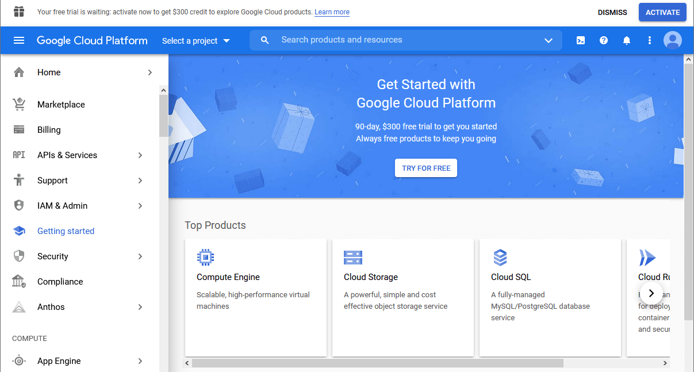
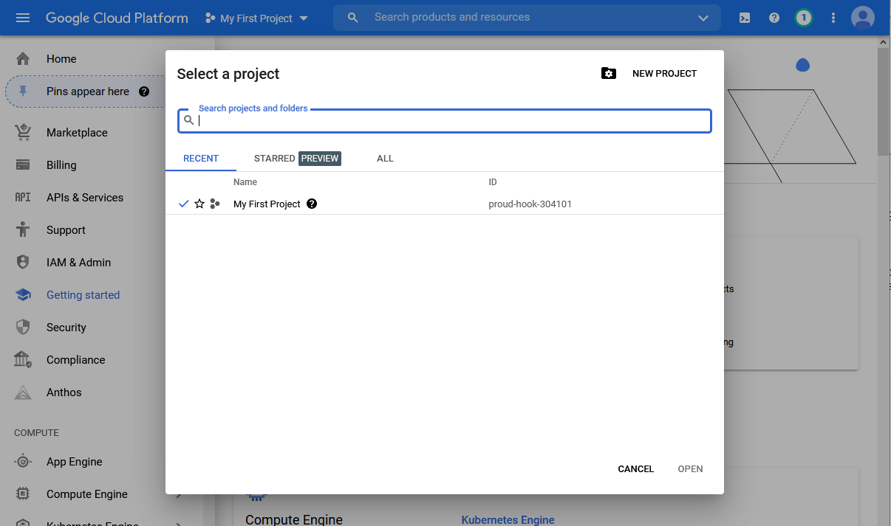
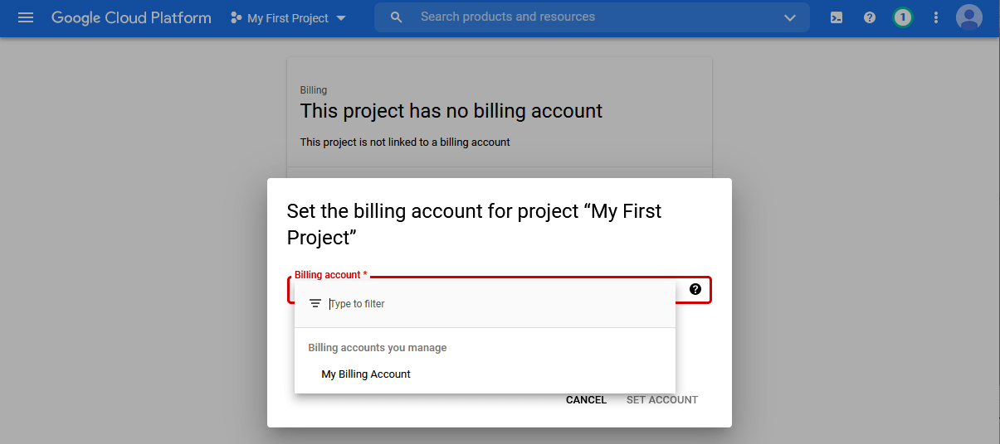
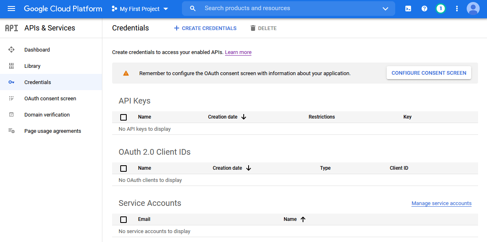
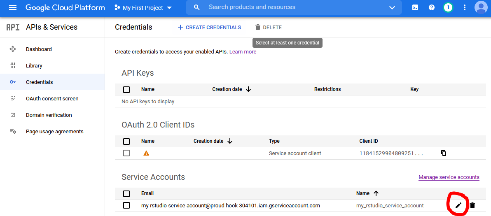
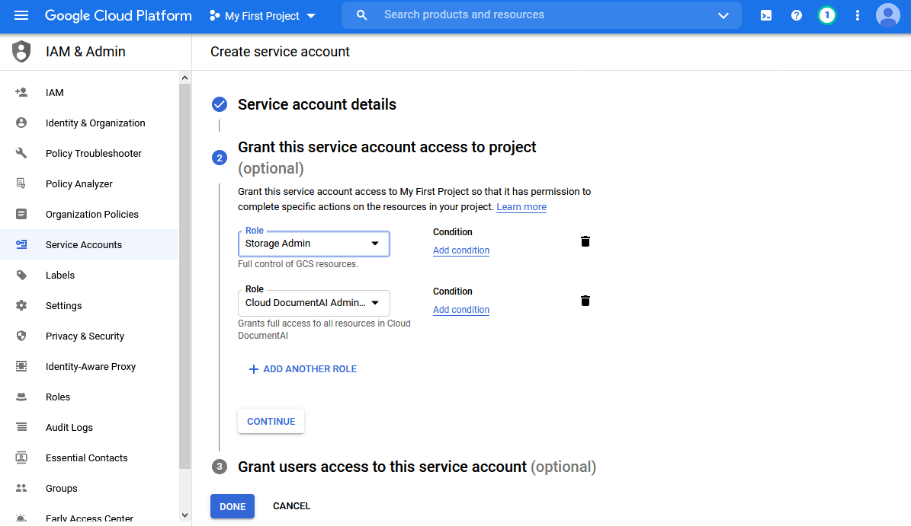

```{r, include = FALSE}
options(rmarkdown.html_vignette.check_title = FALSE)

library(knitr)

opts_chunk$set(
  collapse = TRUE,
  comment = "#>"
)
```

*Last updated 10 February 2024*
\
\

**Command line users: See [here](https://dair.info/articles/gcs_cli.html) for GCS setup using gcloud CLI.**
\
\

This is a rundown for beginners of how to set up a Google Cloud Services account so you can start using Google Document AI.

## Authentication

The biggest hurdle to using any Google API is authentication. It can be daunting, partly because it involves abstract new concepts like "service accounts", "Oauth2.0", and "scopes", and partly because the website you have to work with -- the [Google Cloud Console](https://console.cloud.google.com/) -- is a nightmare to navigate.

There are several different ways to authenticate to GCS from R, and you may have seen that different R packages do it slightly differently (see e.g. [gmailr](https://gmailr.r-lib.org/) and [bigrquery](https://bigrquery.r-dbi.org/)). This vignette takes an opinionated approach and recommends using service accounts and json key files. It involves a little bit more hands-on configuration than some of the setup wizards in other R packages, but my thinking is that if you are computer-literate enough to consider using an API, you are probably also able to navigate the GCS and set environmental variables in R. But know that there are [several](https://cran.r-project.org/package=gargle/vignettes/get-api-credentials.html) [other](https://cran.r-project.org/package=googleAuthR/vignettes/google-authentication-types.html) authentication strategies, and you can use `daiR` with most of them so long as you obtain an authentication token. 

There are nine main steps to go through before you can start using `daiR`.

### Step 1: Get a Gmail account

If you have one already, you can use that. Or you can [create](https://accounts.google.com/signup/v2/webcreateaccount) a burner account for your GCS work.

### Step 2: Activate the Google Cloud Console

While logged in to your gmail account, go to the [Google Cloud Console](https://console.cloud.google.com/). Agree to the terms of service and click "Try for free". 

```{r, echo=FALSE, out.width = "50%"}

```

Accept the terms again, and add an address and a **credit card**. This last part is a prerequisite for using GCS. But Google Document AI is not particularly expensive to use; see the [FAQ page](https://dair.info/articles/faqs.html#how-much-does-google-document-ai-cost-to-use) for updated prices.

### Step 3: Link your project to your billing account

The largest "unit" of your GCS activities is your *project*. You can think of it as your root folder, since you will most likely only ever need one unless you are a business or a developer (though in principle you can have as many projects as you like). 

When you activate GCS, you are assigned a project named "My first project". Click on "My first project" in the top blue bar, just to the right of "Google cloud services". You'll see a screen like this: 

```{r, echo=FALSE, out.width = "50%"}

```

Note that your project has an *ID*, usually consisting of an adjective, a noun, and a number. You'll need this soon, so I recommend opening RStudio and storing it as a vector with `project_id <- "<your project id>"`. 

Return to the Google Cloud Console and look at the left column. Toward the top you see an entry called "Billing". Click it. You'll get to a screen saying "This project has no billing account". Click "link a billing account" and set the billing account to "My billing account". 

```{r, echo=FALSE, out.width = "50%"}

```

All this is necessary for you to be able to use Google Document AI (DAI) and related services programmatically.

### Step 4: Set up a service account

Now we need to create a service account. Bring out the navigation menu on the left hand side by clicking the little circle with the three horizontal lines in the top left of the screen. Click on "APIs and services." Then click on "credentials" in the left pane. You should see this: 

```{r, echo=FALSE, out.width = "50%"}

```

Click on "create credentials" in the top middle, then choose service account. Give it any name you like (e.g. "my_rstudio_service_account") and a description (e.g. "Interacting with GCS through R") and click "create". 

In section 2 titled "Grant this service account access to project", add "Basic > **Owner**" to the service account's roles.

```{r, echo=FALSE, out.width = "50%"}

```

Click "continue", then "done" at the bottom. You should now see your service account listed at the bottom. 

```{r, echo=FALSE, out.width = "50%"}

```

### Step 5: Download a json file with the service account key

Now we need to generate a JSON file containing the credentials for this service account. Click the small edit icon on the bottom right. On the next page, click "add key", choose "create new key", select JSON format, and click "create". This should prompt a save file window. Save the file to your hard drive. You can change the name to something more memorable if you like (but keep the `.json` extension). Also, take note of where you stored it. Now we are done in the Google Cloud Console and can finally start working in RStudio.

### Step 6: Store the path to the credentials file as an environmental variable

You want `daiR` to automatically authenticate you when you load the package so you don't have to fiddle with authentication every time. For this to happen, you need to tell R where it can find the JSON file with the credentials. We do this by storing the path to the json file as an environmental variable in your `.Renviron` file. Start by writing the following in your RStudio console:

```{r, message=FALSE, eval=FALSE}
usethis::edit_r_environ()
```

This will open a pane with your `.Renviron` file. If you haven't modified it before, it is probably empty. 

All you need to do is add a line with the following: **`GCS_AUTH_FILE='<full path to the json file you stored earlier>'`**. Make sure all the slashes in the filepath are forward slashes. It should look something like this:

```
GCS_AUTH_FILE='path/to/gcs-service-account-file.json'
```

Save the file, close it, and restart RStudio. If you try to load `daiR` now with `library(daiR)`, you will be auto-authenticated, but there are a few more steps left before you can start processing. 

### Step 7: Activate Document AI

Head back to your browser and the [GCS website](https://console.cloud.google.com/). We now need to activate the Google Document AI API for your account. Open the navigation menu on the left hand side. Click on "APIs and services". Then click on "Enable APIs and Services", type "document ai" in the search field, click on "Cloud Document AI API", and then "Enable". 

### Step 8: Create a processor

In order to process documents, you also need to set up an OCR processor. This is easiest done inside R using the function `daiR::create_processor`.[^also_gcs] We start by loading the `daiR` package.

[^also_gcs]: It is also possible to create processors manually in the Google Cloud Console.

```{r, eval = FALSE}
library(daiR)
```

You now need to think of a globally unique display name for the processor, to be supplied with the `create_processor()` function. Processor names are shared across the GCS ecosystem, so simple ones like "processor" or "my-processor" are probably already taken. Instead try something along the lines of "ocr-general-9567".

If successful, the `create_processor()` function will return a processor id, a 16-character sequence of random numbers and letters. Take good note of it, for while the name ("ocr-general-9567") is just a display name to help you distinguish between processors when you have several, the id is what really identifies it to the Document AI API.

```{r, eval = FALSE}
## NOT RUN
id <- create_processor("<my-unique-processor-name>")
```

It is possible to create more than one processor, but most users only need one at any given time. To view your processors, run `daiR::get_processors()`. Should you wish to delete one, use `daiR::delete_processor()`. 

There are several [different types](https://dair.info/articles/faqs.html#how-many-different-processors-are-there) of processors available, but most users will want the generic one (called `OCR_PROCESSOR`), and this is what `daiR::create_processor()` defaults to. The other main type to note is `FORM_PARSER_PROCESSOR`, which can identify tables.

Processor types also come in different *versions*, with each version representing a snapshot of the underlying machine learning model. There will typically be a couple of stable versions and a more recent, pre-release version of any one processor type. The difference in performance between versions is rarely substantial, so you do not need to worry about specifying a processor version at this stage. 

### Step 9: Store the processor id as an environment variable

Every Document AI processing request needs to contain a processor id, so I strongly recommend storing the id you just generated in an environment variable called `DAI_PROCESSOR_ID`. All of `daiR`'s processing functions are set up to look for this variable. 

Open your `.Renviron` file by calling `usethis::edit_r_environ()`. Add `DAI_PROCESSOR_ID="<your processor id>"` on a separate line. Your `.Renviron` may now look something like this:

```
GCS_AUTH_FILE='path/to/gcs-service-account-file.json'
DAI_PROCESSOR_ID='1234567890abcdef'
```

Save `.Renviron` and restart RStudio. That's it: You're now ready to [start processing](https://dair.info/articles/gcs_cli.html). Note that in order to process asynchronously (best for large batches), you will need to familiarise yourself with Google Cloud Storage as well, so you may want to look at the [vignette on Google Cloud Storage](https://dair.info/articles/gcs_storage.html) right away.

### Cheatsheet

If you ever get lost in the jungle of GCS terms, check out the [concept cheatsheet](https://dair.info/articles/cheatsheet.html).