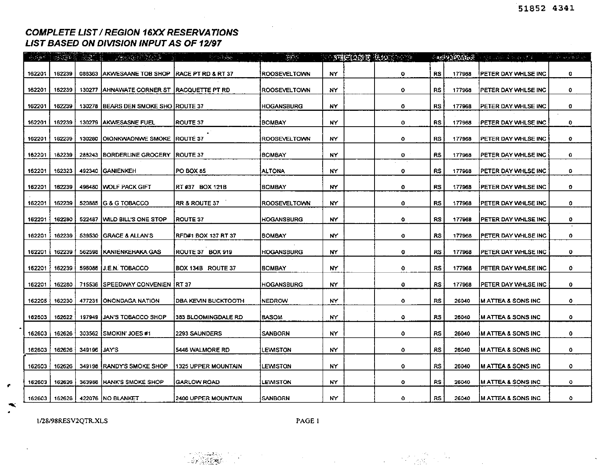
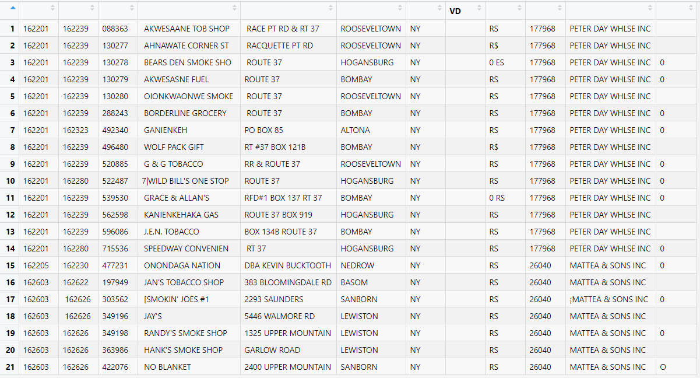

```{r, include = FALSE}
options(rmarkdown.html_vignette.check_title = FALSE)
library(knitr)
opts_chunk$set(
  collapse = TRUE,
  comment = "#>"
)
```

**Last updated 4 April 2021**
\
\
\

In optical character recognition (OCR) of historical documents, we're often interested in extracting tables and getting the data into R in tidy format. Having been designed primarily for processing business documents, Google Document AI has very powerful table extraction capabilities. With the help of the `daiR` package, you can get these tables into R dataframes with a single line of code.

To extract table data, we use the `dai_sync_tab()` and `dai_async_tab()` commands. They work much like their siblings `dai_sync()`/`dai_async()` except that their responses also include table data. In return, the `*sync_tab()` functions have weaker language support (they currently only work for English-language documents).^[Under the hood, the `*sync()` and `*sync_tab()` functions access different endpoints in the Document AI API, each with its own capabilities. I expect these capabilities to be consolidated in a single endpoint in the future, in which case the `*sync_tab()` functions will be deprecated.] 

To get the table data into R, we use the functions `tables_from_dai_response()` and `tables_from_dai_file()`. They do the same thing, but take different inputs. You use the former for response objects obtained with `dai_sync_tab()` and the latter for .json files obtained with `dai_async_tab()`.

## Tables from response objects

Let's try sync-processing a small pdf from the so-called [Truth Tobacco Industry Documents](https://en.wikipedia.org/wiki/Truth_Tobacco_Industry_Documents). It contains four tables like this: 

```{r, echo=FALSE, out.width = "100%"}

```

First we download it and send it to Document AI for processing:
```{r, eval=FALSE}
library(daiR)
setwd(tempdir())
download.file("https://archive.org/download/tobacco_lpnn0000/lpnn0000.pdf", 
              destfile = "tobacco.pdf",
              mode = "wb")

resp <- dai_sync_tab("tobacco.pdf")
```

To get the tables into R, we pass the response object (`resp`) to our extraction function:

```{r, eval=FALSE}
tables <- tables_from_dai_response(resp)
```

Note that the output is not a dataframe but a *list* of dataframes. We access the individual tables either by their index, like so:

```{r, eval=FALSE}
table1 <- tables[[1]]
```

... or by importing them all into our global environment with `assign()`, as follows:

```{r, eval=FALSE}
for(i in 1:length(tables)) {
  assign(paste0("table", i), tables[[i]])
}
```

Either way, the result is pretty good. Here's what the first table looks like in my RStudio before any cleaning:

```{r, echo=FALSE, out.width = "100%"}

```

## Tables from json files

With json files obtained from `dai_async_tab()` the process is very similar, except that we pass a filepath instead of a response object to the extraction function. If we processed the same document asynchronously and obtained a file named `"tobacco.json"`, we would extract the tables like this:

```{r, eval=FALSE}
## NOT RUN
tables <- tables_from_dai_file("tobacco.json")
```

That's all there is to it.

Note that the quality of the output depends on the structure of the original table. Like all other table extraction engines, DAI struggles with complex tables that contain row and column spans. In such cases you can usually turn DAI's initial output into a decent dataframe with a bit of data cleaning inside R. In most cases, though, Document AI delivers very decent output that `daiR` can turn into workable R dataframes in a matter of seconds. 
