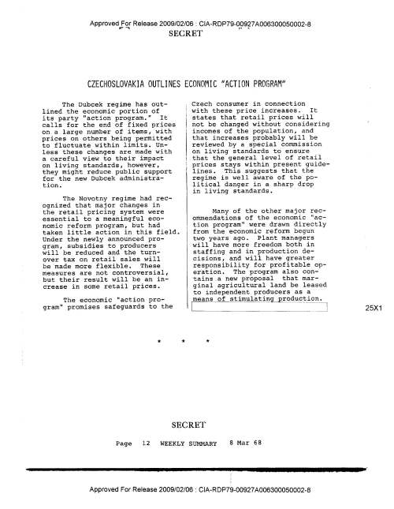
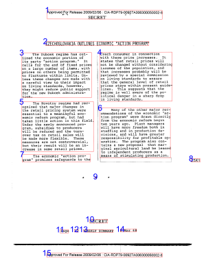
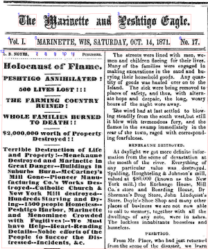
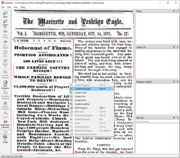
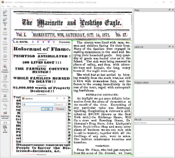

```{r, include = FALSE}
options(rmarkdown.html_vignette.check_title = FALSE)
library(knitr)
opts_chunk$set(
  collapse = TRUE,
  comment = "#>"
)
```

*Last updated 10 February 2024*
\
\
\
**Note: Google Document AI's processors are gradually getting better. When you process the documents in this vignette, you may not encounter the same column-reading problem as I did when I wrote it. But the general principles and techniques are transferable to other cases where column-reading problems do arise.**

\
\
Google Document AI (DAI) has excellent character recognition, but often reads columns wrong. This vignette will show you how to identify and reorder jumbled text with the tools in the `daiR` package.  

## The problem

Server-based OCR engines such as Google Document AI and Amazon Textract represent a major advance in OCR technology. They handle visual noise extremely well and effectively eliminate the need for image preprocessing, the most agonizing part of OCR in `tesseract` and other standalone libraries. DAI also reads non-Western languages such as Arabic better than any other general engine I have seen. 

But DAI and Textract still struggle with text columns and irregular page layouts. In my experience, DAI will misread a multi-column page about a third of the time, and the error rate increases with the complexity of the layout. This is not a problem if you plan to apply "bag-of-words" text mining techniques, but if you're looking at Natural Language Processing or actually reading the text, you cannot trust Document AI or Textract to always return accurate text. 

DAI column-reading errors are of two main types. The first is to put text blocks in the wrong order, and the second is to merge blocks that shouldn't be merged. Both errors can be corrected programmatically with the tools in the `daiR` package.    

Note that the solutions proposed here are not the only ways to address this problem. An alternative approach consists of adopting a two-stage procedure whereby you first use an object detection model such as [LayoutParser](https://layout-parser.github.io/) to identify individual columns of text, the images of which you then pass on to Document AI for character recognition. But this involves Python and is beyond the scope of what `daiR` alone can do.

## Reordering blocks

To illustrate the problem, let's feed DAI a simple two-column text. This one is from the CIA's archive of declassified intelligence documents:

```{r, message=FALSE, eval=FALSE}
setwd(tempdir())
url <- "https://www.cia.gov/readingroom/docs/1968-03-08.pdf"
download.file(url, "CIA_columns.pdf")
```

```{r, echo=FALSE, out.width = "50%"}

```

We start by uploading it to Google Storage and telling Document AI to process the document from there. `dai_notify()` will beep when the processing is done. 

```{r, eval=FALSE}
library(daiR)
library(googleCloudStorageR)
gcs_upload("CIA_columns.pdf")
resp <- dai_async("CIA_columns.pdf")
dai_notify(resp)
```

Then we search for a JSON file containing the string "CIA_columns" and download it.

```{r, echo=FALSE, eval=FALSE}
contents <- gcs_list_objects()
our_json <- grep("CIA_columns.*json", contents$name, value = TRUE)
gcs_get_object(our_json, saveToDisk = "CIA_columns.json")
```

Then we extract the text.

```{r, eval=FALSE}
text <- get_text("CIA_columns.json", type = "async")
cat(text)
```

On first inspection, this does not look so bad. But notice the transition from the first to the second paragraph: 

> ... they might reduce public support for the new Dubcek administration. Czech consumer in connection with these price increases.

Something's not right. Could it be a column-reading error?

We can find out with the function `draw_blocks()`, which extracts boundary box data from the `.json` file and draws numbered rectangles on an image of each page of the source document. (The images come from the json file, where they are stored as base64-encoded strings.) 

```{r, eval=FALSE}
draw_blocks("CIA_columns.json", type = "async")
```

Check your temporary directory (type `tempdir()` for the path) for a file ending in `_blocks.png` and pull it up:

```{r, echo=FALSE, out.width = "50%"}

```

We can immediately see that the blocks are in the wrong order. How to fix this?

Fortunately, the `.json` file from DAI comes with a ton of data that allow us to programmatically reorder the text. The key is to generate a token dataframe with page location data and then filter and reorder as necessary. We create the dataframe with `build_token_df()`:

```{r, eval=FALSE}
token_df <- build_token_df("CIA_columns.json")
str(token_df)
```

The dataframe has the words in the order in which DAI proposes to read them, and the `block` column has the number of the block to which each word belongs. This allows us to reorder the blocks while keeping the within-block word order intact. 

We see from the annotated image that the real order of the blocks should be 1 - 2 - 3 - 5 - 7 - 4 - 6. We can store this in a vector that we use to reorder the dataframe. 

```{r, eval=FALSE}
order <- c(1, 2, 3, 5, 7, 4, 6)
token_df$block <- factor(token_df$block, levels = order)
token_df_correct <- token_df[order(token_df$block),]
```

We get the correct text from the `token_df_correct$token` column:

```{r, message = FALSE, warning = FALSE, eval=FALSE}
library(dplyr)
text <- token_df_correct$token %>% 
  paste(collapse = "")
```

Now the transition from the first to the second paragraph makes more sense:

```{r, eval=FALSE}
snippet <- substr(text, start = 1, stop = 700)
cat(snippet)
```

## Splitting blocks

A more complex --- and, unfortunately, more common --- situation is when DAI fails to distinguish between columns. This means that lines do not end where they should, resulting in long stretches of incomprehensible text. We can illustrate this with an article about the great [Peshtigo forest fire](https://en.wikipedia.org/wiki/Peshtigo_fire) in Wisconsin in 1871, available on the Internet Archive.

```{r, echo=FALSE, out.width = "50%"}

```

We do our processing routine again:

```{r, eval=FALSE}
url <- "https://archive.org/download/themarinetteandpeshtigoeagleoct141871/The%20Marinette%20and%20Peshtigo%20Eagle%20-%20Oct%2014%201871.pdf"
download.file(url, "peshtigo.pdf")
gcs_upload("peshtigo.pdf")
resp <- dai_async("peshtigo.pdf")
dai_notify(resp)

```

```{r, eval=FALSE}
contents <- gcs_list_objects()
our_json <- grep("peshtigo.*json", contents$name, value = TRUE)
gcs_get_object(our_json, saveToDisk = "peshtigo.json")
```

This time we'll skip the text printout and go straight to inspecting the boundary boxes:

```{r, eval=FALSE}
draw_blocks("peshtigo.json", type = "async")
```

```{r, echo=FALSE, out.width = "50%"}

```

As we can see, this time DAI has failed to distinguish between the two main columns. We can verify this by checking the beginning of the text:

```{r, eval=FALSE}
text <- text_from_dai_file("peshtigo.json")
snippet <- substr(text, start = 1, stop = 1000)
cat(snippet)
```

This means that we must find a way of splitting block 12 vertically. 

What we will do is create a new boundary box that captures only the right-hand column. Then we will feed the location coordinates of the new box back into the token dataframe so that the tokens that fall within it are assigned a new block number. We can then reorder the blocks as we did in the previous example.

There are two main ways to obtain the coordinates of a new block: mathematically or through image annotation.

### Mathematical splitting

We can split blocks mathematically by using the location data for existing blocks in the json file. We start by building a block dataframe to keep track of the blocks. 

```{r, eval=FALSE}
block_df <- build_block_df("peshtigo.json")
```

Then we use the function `split_block()` to cut block 12 vertically in half. This function takes as input a block dataframe, the page and number of the block to split, and a parameter `cut_point`, which is a number from 1 to 99 for the relative location of the cut point. `split_block()` returns a new block dataframe that includes the new block and revised coordinates for the old one. 

```{r, eval=FALSE}
new_block_df <- split_block(block_df, block = 12, cut_point = 50)
```

If we had more blocks to split, we could repeat the procedure as many times as necessary. We just have to make sure to feed the latest version of the block dataframe into the `split_block()` function. 

When we have a block dataframe that captures the layout fairly accurately, we can use the `reassign_tokens()` function to assign new block values to the words in the *token* dataframe. `reassign_tokens()` takes as input the token dataframe and the new block dataframe and returns a revised token dataframe.

```{r, eval=FALSE}
token_df <- build_token_df("peshtigo.json")
token_df_correct <- reassign_tokens(token_df, new_block_df)  
```

In this particular case, the blocks are in the right order after splitting, so we can extract a correct text right away. In other cases the blocks may need reordering, in which case we use the procedure from the previous section.  

```{r, eval=FALSE}
text <- token_df_correct$token %>% 
  paste(collapse = "")
snippet <- substr(text, start = 1, stop = 1000)
cat(snippet)
```

Mathematical splitting will often be the easiest method, and it can be particularly efficient when you have a lot of documents with the exact same column structure. However, it may sometimes be difficult to tell with the naked eye where the cut point should be. At other times the space between columns may be so narrow as to make precision important. For these situations we can use manual image annotation. 

### Manual splitting

In principle you can use any image annotation tool, so long as you format the resulting coordinates in a way that `daiR`'s processing functions understand. In the following, I will use [labelme](https://github.com/wkentaro/labelme) because it's easy to use and `daiR` has a helper function for it.

Labelme opens from the command line, but has a fairly intuitive graphical user interface. We load the annotated image generated by `draw_blocks()`, click "create polygons" in the left pane, right-click while the cursor is in the page pane, and choose "create rectangle". 

```{r, echo=FALSE, out.width = "50%"}

```

Then we mark the right-hand column and label it 13 (for the number of the new block).

```{r, echo=FALSE, out.width = "50%"}

```

Click "save" and store the json file, for example as `peshtigo1_blocks.json`. Now we can load it in R and get the coordinates of the new block 13 with the function `from_labelme()`. This function returns a one-row dataframe formatted like block dataframes generated with `build_block_df`.

```{r, eval=FALSE}
block13 <- from_labelme("peshtigo1_blocks.json")
```

We can then assign a new block number to the tokens that fall within block13. For this we use `reassign_tokens2()`, which reassigns tokens on a specified page according to the coordinates of a single new block. 

```{r, eval=FALSE}
token_df_new <- reassign_tokens2(token_df, block13) 
```

Now we just need to reorder the token data frame by blocks, and the words will be in the right order. In this particular case, we do not need to supply a custom block order, since the block numbering reflects the right order of the text.

```{r, eval=FALSE}
token_df_correct <- token_df_new[order(token_df_new$block), ]
```

And again we have a text in the right order. 

```{r, eval=FALSE}
text <- token_df_correct$token %>%
  paste(collapse = "")
snippet <- substr(text, start = 1, stop = 1000)
cat(snippet)
```

```{r, echo=FALSE, message=FALSE, warning=FALSE, eval=FALSE}
#cleanup
contents <- gcs_list_objects()
map(contents$name, gcs_delete_object)
```
