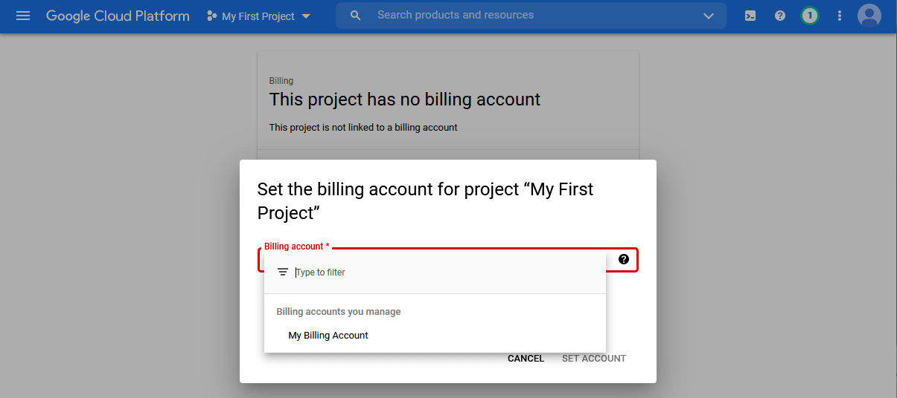
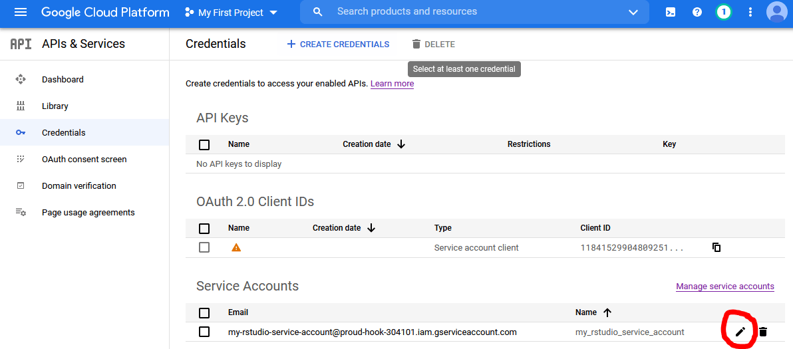

```{r, include = FALSE}
options(rmarkdown.html_vignette.check_title = FALSE)

library(knitr)

opts_chunk$set(
  collapse = TRUE,
  comment = "#>"
)
```

**Last updated 4 April 2021**
\
**Command line users: See [here](https://dair.info/articles/gcs_cli.html) for GCS setup using gcloud CLI.**
\
\

This is a rundown for beginners of how to set up and interact with Google Storage in R. You need Google Storage in order to use Document AI and other Google APIs on scale, because these services do not accept bulk file submissions directly. Instead they use Google Storage as an intermediary, so you need to know how to get files in and out of it.    

It is possible to bulk upload and download files to Google Storage in the [Google Cloud Console](https://console.cloud.google.com/storage). In fact, for uploads it can sometimes be easier than doing it programmatically. But downloads and deletions are cumbersome if you have a lot of files. And since bulk processing in DAI can only be done with code, you might as well keep the whole workflow in R. 

## Authentication

The biggest hurdle to using any Google API is authentication, which is daunting for several reasons. It involves abstract new concepts like "service accounts", "Oauth2.0", and "scopes". Moreover, the Google Cloud Console is so crowded it's a nightmare to navigate as a beginner. In addition, different R packages have different procedures for authenticating with Google Cloud Services (GCS).

A full explanation of Google API authentication could fill a book, but suffice to say here that there are several different ways to authenticate to GCS from R. In the following I will walk you through one such way, the one I think is the simplest and most robust if you are primarily planning to use Google Storage and Google Document AI and to do so in an interactive setting. 

The procedure outlined below relies on service accounts and json key files. It involves a little bit more hands-on configuration than some of the setup wizards in other Google API wrappers, but the solution is robust and secure. My thinking is: if you are computer-literate enough to consider working programmatically with an API, you are also able to find your way around the Google Cloud Console. But know that there are [several](https://cran.r-project.org/package=gargle/vignettes/get-api-credentials.html) [other](https://cran.r-project.org/package=googleAuthR/vignettes/google-authentication-types.html) authentication strategies; which is better depends on where and how you intend to use the R wrapper.

### Step 1: Get a Gmail account

If you have one already, you can use that. Or you can [create](https://accounts.google.com/signup/v2/webcreateaccount) a burner account for your GCS work.

### Step 2: Activate the Google Cloud Console

While logged in to your gmail account, go to the [Google Cloud Console](https://console.cloud.google.com/). Agree to the terms of service and click "Try for free". 

```{r, echo=FALSE, out.width = "50%"}
include_graphics("storage1.PNG")
```

Accept the terms again, and add an address and a **credit card**. This last part is a prerequisite for using GCS.

### Step 3: Link your project to your billing account

The largest "unit" of your GCS activities is your *project*. You can think of it as your root folder, since you will most likely only ever need one unless you are a business or a developer (in principle, though, you can have as many projects as you like). 

When you activate GCS, you are assigned a project named "My first project". Click on "My first project" in the top blue bar, just to the right of "Google cloud services". You'll see a screen like this: 

```{r, echo=FALSE, out.width = "50%"}
include_graphics("storage2.PNG")
```

Note that your project has an *ID*, usually consisting of an adjective, a noun, and a number. You'll need this soon, so I recommend opening RStudio and storing it as a vector with `project_id <- "<your project id>"`. 

Return to the Google Cloud Console and look at the left column. Toward the top you see an entry called "Billing". Click it. You'll get to a screen saying "This project has no billing account". Click "link a billing account" and set the billing account to "My billing account". 

```{r, echo=FALSE, out.width = "50%"}

```

All this is necessary for you to be able to access Google Storage and other Google tools programmatically. Both Google Storage and DAI are paid services, although for Google Storage the cost is negligible unless you plan to keep very large amounts of data there for a long time. For DAI, you're looking at around EUR 0.06 per processed page, though at the current time of writing, you get 300$ worth of free credits. 

### Step 4: Set up a service account

Now we need to create a service account. Bring out the navigation menu on the left hand side by clicking the little circle with the three horizontal lines in the top left of the screen. Click on "APIs and services." Then click on "credentials" in the left pane. You should see this: 

```{r, echo=FALSE, out.width = "50%"}
include_graphics("storage4.PNG")
```

Click on "create credentials" in the top middle, then choose service account. Give it any name you like (e.g. "my_rstudio_service_account") and a description (e.g. "Interacting with GCS through R") and click "create". 

In section 2 titled "Grant this service account access to project", add "Basic > **Owner**" to the service account's roles.  

```{r, echo=FALSE, out.width = "50%"}

```

Click "continue", then "done" at the bottom. You should now see your service account listed at the bottom. 

```{r, echo=FALSE, out.width = "50%"}
include_graphics("storage6.PNG")
```

### Step 5: Download a json file with the service account key

Now we need to generate a json file containing the login details for this service account. Click the small edit icon on the bottom right. On the next page, click "add key", choose "create new key", select JSON format, and click "create". This should prompt a save file window. Save the file to your hard drive. You can change the name to something more memorable if you like (but keep the ".json" extension). Also, take note of where you stored it. Now we are done in the Google Cloud Console and can finally start working in RStudio.

### Step 6: Tell RStudio where to find the json file

The last step is to store the path to the json file in your .Renviron file so that RStudio can authenticate you whenever you are working with GCS from R. Start by writing the following in the console:

```{r, message=FALSE, eval=FALSE}
usethis::edit_r_environ()
```

This will open a pane with your .Renviron file. If you haven't modified it before, it is probably empty. 

All you need to do is add a line with the following: **`GCS_AUTH_FILE='<full path to the json file you stored earlier>'`**. Make sure all the slashes in the filepath are forward slashes. Save the file, close it, and restart RStudio.

Now when you load the library `googleCloudStorageR`, you will be auto-authenticated and ready to communicate with your Google Storage account from within R. 

```{r, message=FALSE}
library(googleCloudStorageR)
```

## Working with googleCloudStorageR

`googleCloudStorageR` is a so-called wrapper for the Google Storage API, which means it translates your R input into URLs that the API can understand. When you execute `googleCloudStorageR` functions, you are really sending GET and POST requests to Google and receiving responses in return.

### Creating and inspecting buckets

Google Storage is a file repository, and it keeps your files in so-called "buckets". You need at least one bucket to store files. To inspect your Storage account, first bring out your project id. If you did not store it in step 3 above, you can look it up in the Google Cloud Console or use the `daiR` function `get_project_id()`. 

```{r, eval=FALSE}
project_id <- daiR::get_project_id()
```

Now let's see how many buckets we have:
```{r, eval = FALSE}
gcs_list_buckets(project_id)
```

Answer: zero, because we haven't created one yet. We can do this with `gcs_create_bucket()`. Note that it has to be globally unique ("my_bucket" won't work because someone's already taken it). For this example, let's use "dair-example-bucket". Also add a location ("EU" or "US").

```{r, eval = FALSE}
gcs_create_bucket("dair-example-bucket", project_id, location = "EU")
```

Now we can see the bucket listed:
```{r, eval=FALSE}
gcs_list_buckets(project_id)
```

You will need to supply a bucket name with every call to Google Storage (and Document AI), so you may want to store the name of a default bucket in the environment. You have two options:

1) Store it permanently in you .Renviron file by calling `usethis::edit_r_environ()` and adding `GCS_DEFAULT_BUCKET=<your bucket name>` to the list of variables, just as you did with the json key file path (`GCS_AUTH_FILE`) earlier. Note that adding a default bucket to .Renviron will not prevent you from supplying other bucket names in individual calls to Google Storage when necessary. 

2) Set it for the current session with `gcs_global_bucket("<your bucket name>")`


To get a bucket's file inventory, we use `gcs_list_objects()`. Leaving the parentheses empty will get information about the default bucket if you have set it.
```{r, eval=FALSE}
gcs_list_objects()
```

At this point it's obviously empty, so let's upload something. 

### Uploading files

This we do with `gcs_upload()`. If the file is in your working directory, just write the filename; otherwise provide the full file path. If you want, you can store the file under another name in Google Storage with the `name` parameter. Otherwise, just leave the parameter out.  

```{r, eval=FALSE}
setwd(tempdir())
write.csv(mtcars, "mtcars.csv")
resp <- gcs_upload("mtcars.csv")
```

`resp` here is just a container for the response that the API returns, to prevent it from printing in the console. 

Now let's check the contents:
```{r, eval=FALSE}
contents <- gcs_list_objects()
contents
```

The Google Storage API handles only one file at a time, so for bulk uploads you need to use iteration.  

```{r, eval=FALSE}
library(purrr)
library(fs)
write.csv(iris, "iris.csv")
my_files <- dir_ls(glob = "*.csv")
resp <- map(my_files, ~ gcs_upload(.x, name = .x))
```

Let's check the contents again:
```{r, eval=FALSE}
contents <- gcs_list_objects()
contents
```

Note that there's a file size limit of 5Mb, but you can change it with `gcs_upload_set_limit()`. 
```{r, eval=FALSE}
gcs_upload_set_limit(upload_limit = 20000000L)
```

### Downloading files

Downloads are performed with gcs_get_object(). Here, too, you can save it under a different name, but this time the parameter is `saveToDisk`.

```{r, eval=FALSE}
resp <- gcs_get_object("mtcars.csv", saveToDisk = "mtcars_duplicate.csv")
```

To download multiple files we need to loop or map. Let's say we wanted to download all the files in the bucket:

```{r, eval=FALSE}
contents <- gcs_list_objects()
resp <- map(contents$name, ~ gcs_get_object(.x, saveToDisk = .x, overwrite = TRUE))
```

### Deleting

We can delete files in the bucket with `gcs_delete_object()`: 
```{r, eval=FALSE}
gcs_delete_object("mtcars.csv")
```

To delete several, we again need to loop or map. Let's try to delete everything in the bucket:

```{r, eval=FALSE}
contents <- gcs_list_objects()
map(contents$name, gcs_delete_object)
```

And the bucket is empty. With this you should be ready to process files with Document AI and other APIs that involve Google Storage as an intermediary.

```{r, echo=FALSE, message=FALSE, warning=FALSE, eval=FALSE}
# cleanup
file_delete(dir_ls(tempdir(), glob = "*.csv"))
```
